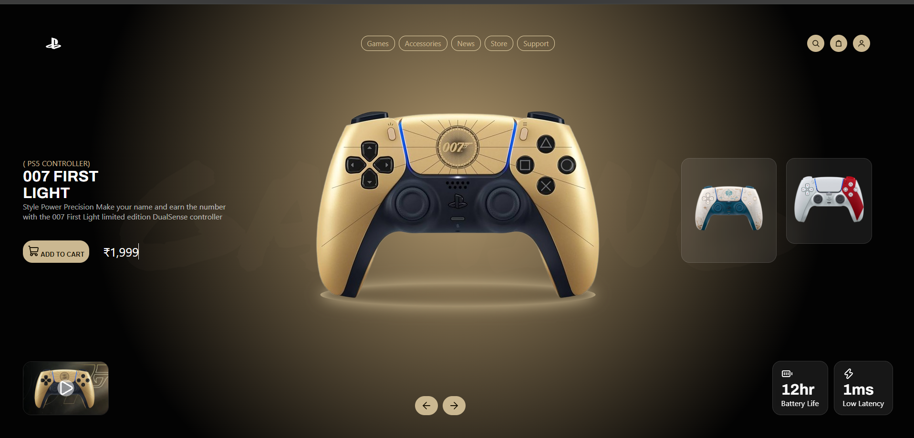

# PS5 Controller Showcase

A product showcase landing page for limited-edition PS5 DualSense controllers, built with HTML, CSS and JavaScript.

I saw this design in a screen recording and rebuilt it from scratch as a practice project: no template, no copied code.

**Live demo:** https://ps5-controller-landing-page.vercel.app/



## Status

- [x] Static layout (007 First Light theme)
- [x] Theme colors set up as CSS variables
- [ ] JavaScript slider for switching controllers
- [ ] Theme switching (007 First Light, Genshin Impact, God of War)
- [ ] Animations
- [ ] Responsive layout for tablet and mobile

## What's built so far

- Navbar with logo, pill links and icon buttons
- Hero section with the controller, a faded "GAMING" background word and a glowing ring underneath
- Glass-style cards for the thumbnails, video card and stats (backdrop blur and translucent borders)
- Video card that links to the trailer
- Prev and Next arrow buttons
- All colors come from CSS variables, so a theme is just a different set of values

## Built with

- HTML5
- CSS3 (Grid, Flexbox, custom properties, `backdrop-filter`)
- JavaScript (slider in progress)
- Google Fonts: Archivo, Inter, Permanent Marker
- Icons from [Lucide](https://lucide.dev)

## Project structure

```
ps5-controller-showcase/
├── index.html
├── style.css
├── script.js
├── Assets/
│   ├── 007.png
│   ├── genshin.png
│   ├── godofwar.png
│   ├── thumb-007.jpg
│   └── Svg/
└── README.md
```

Adjust the file names above if yours are different.

## Run it locally

1. Clone the repo:
   ```
   git clone https://github.com/<your-username>/ps5-controller-showcase.git
   ```
2. Open the folder in VS Code.
3. Right-click `index.html` and choose **Open with Live Server**, or just open the file in your browser.

## What I learned

- Planning the layout as boxes before writing any CSS saves a lot of time
- Why `box-sizing: border-box` matters when a page is `100vh` tall with padding
- Keeping every color in CSS variables so a theme change is a single attribute

## Credits and disclaimer

- Original design: [add the designer's name or link here]. This is not my design. I only recreated it to practice.
- PlayStation, DualSense, 007 First Light, Genshin Impact and God of War names, logos and artwork belong to their respective owners. This is a non-commercial practice project and is not affiliated with or endorsed by any of them.
- If you are a rights holder and want something removed, please open an issue and I will take it down.

## Author

**Harshit Thakral**
- LinkedIn: [harshit-thakral](https://www.linkedin.com/in/harshit-thakral/)
- GitHub: harshcodesxd